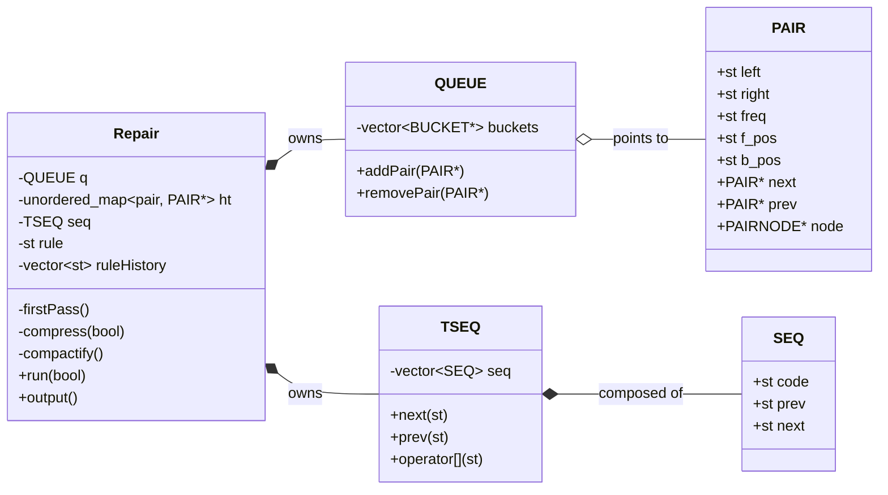

# Class Diagram

```mermaid
classDiagram
    direction LR
    
    class Repair {
        -QUEUE q
        -unordered_map~pair, PAIR*~ ht
        -TSEQ seq
        -st rule
        -vector~st~ ruleHistory
        -firstPass()
        -compress(bool)
        -compactify()
        +run(bool)
        +output()
    }

    class QUEUE {
        -vector~BUCKET*~ buckets
        +addPair(PAIR*)
        +removePair(PAIR*)
    }

    class TSEQ {
        -vector~SEQ~ seq
        +next(st)
        +prev(st)
        +operator[](st)
    }


    class PAIR {
        +st left
        +st right
        +st freq
        +st f_pos
        +st b_pos
        +PAIR* next
        +PAIR* prev
        +PAIRNODE* node
    }

    class SEQ {
        +st code
        +st prev
        +st next
    }

    Repair *-- QUEUE : owns
    Repair *-- TSEQ : owns
    QUEUE o-- PAIR : points to
    TSEQ *-- SEQ : composed of
```

(This is all for now, I'll add more stuff later)
