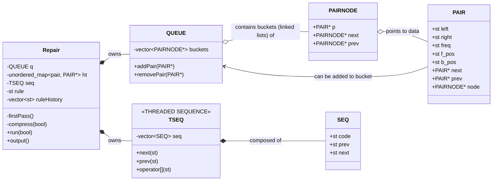

# What is this code?

This is an implementation of the Re-Pair algorithm for research purposes. Try running it on different data :)! Still a work in progress.

# Class Diagram

(This is all for now, I'll add more stuff later)
